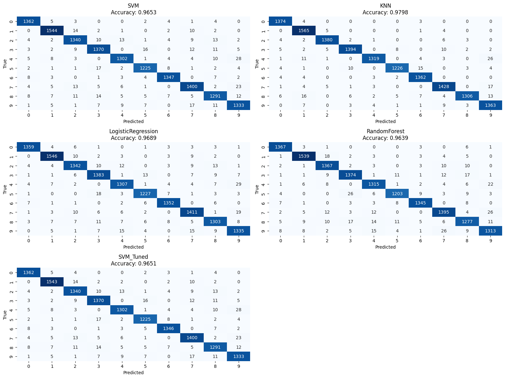
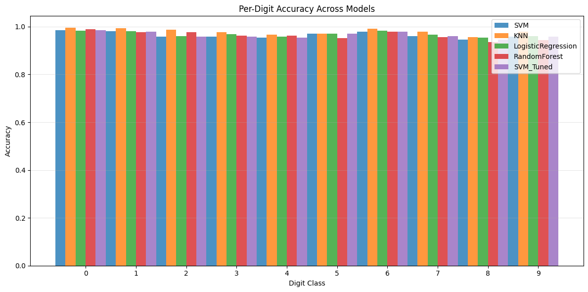
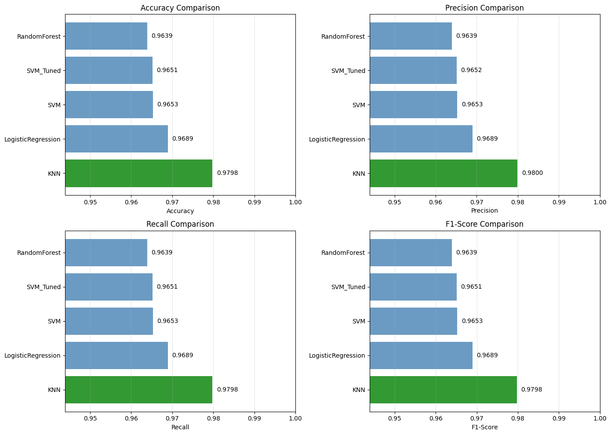
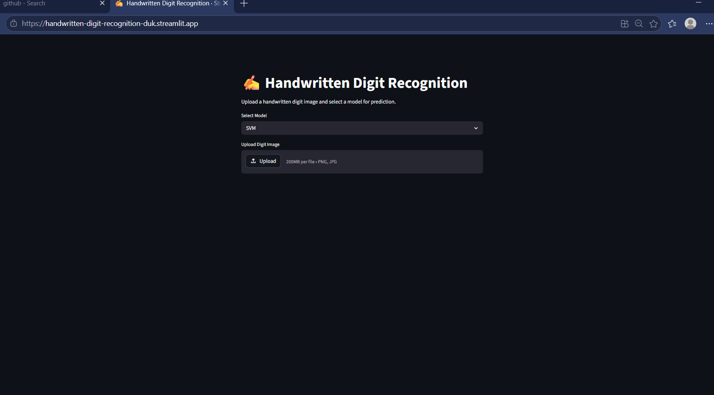
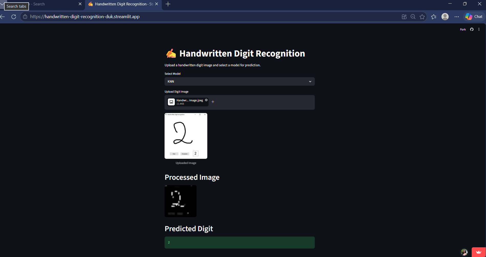

# Handwritten-Digit-Recognition-Using-HOG-Pixel-Intensity-and-SVM

## 👥 Team Members
- Anu Gopal V (Msc Data Science and Bio Ai)
- Anamika A (Msc Computer Science Specialization in Data Analytics)
- Ardra VS (Msc Data Analytics and Computational Science)

## 📌 Problem Statement

Handwritten digit recognition is a classification problem in machine learning where the goal is to identify digits (0–9) from image data. Each input image represents a handwritten digit, and the task is to correctly classify it into one of the ten possible classes.

## 💡 Motivation

This problem has important real-world applications, including:
- Automatic reading of handwritten numbers in bank cheques
- Postal code recognition in mail sorting systems
- Digitizing handwritten documents for digital storage

Solving this problem helps in automating processes that traditionally require manual effort, improving efficiency and accuracy.

---

## 📊 Dataset Description

- Dataset: MNIST (Modified National Institute of Standards and Technology)
- Source: OpenML (accessed via Scikit-learn)
- Total Samples: 70,000 images  
  - Training set: 60,000 images  
  - Test set: 10,000 images  
- Image Size: 28 × 28 pixels (grayscale)
- Features: Each image is represented by 784 pixel intensity values (28×28 flattened)
- Classes: 10 (digits 0–9)
- Type of Problem: Multi-class classification

---

## ⚙️ Methodology Overview

The project follows a structured machine learning pipeline consisting of multiple stages, from data understanding to model deployment.

### 1. Problem Definition
- Defined the objective of recognizing handwritten digits (0–9)
- Identified the task as a multi-class classification problem

### 2. Data Exploration
- Loaded the MNIST dataset
- Analyzed dataset structure and dimensions
- Visualized sample digit images
- Examined class distribution and pixel values

### 3. Preprocessing
- Normalized pixel values to improve model performance
- Reshaped image data into suitable format for processing

### 4. Feature Extraction
- Extracted features using:
  - Pixel Intensity (raw pixel values)
  - HOG (Histogram of Oriented Gradients) to capture edges and shapes
- Converted images into numerical feature vectors

### 5. Model Training
- Trained a Support Vector Machine (SVM) classifier
- Used extracted features as input to the model

### 6. Model Evaluation
- Tested the trained model on unseen data
- Compared predicted labels with actual labels
- Evaluated performance using accuracy

### 7. Deployment
- Deployed the trained model using Streamlit
- Built an interactive web application for real-time predictions

## 📈 Results Summary

The models were evaluated on unseen test data to assess their performance in handwritten digit recognition.

### Evaluation Metrics
The following metrics were used:
- Accuracy
- Precision
- Recall
- F1-Score

### Model Performance

| Model                | Accuracy |
|---------------------|----------|
| K-Nearest Neighbors | **97.98%** |
| Logistic Regression | 96.89% |
| Support Vector Machine (SVM) | 96.53% |
| Random Forest       | 96.39% |

### Observations
- KNN achieved the highest accuracy among all models.
- All models performed well due to effective feature extraction.
- HOG features improved classification by capturing structural patterns of digits.
- SVM and Logistic Regression also showed strong performance.

### 📊 Visual Evaluation

#### Confusion Matrix

#### Per Digit Accuracy

### Model Comparison (Bar Chart)

  

### Conclusion
KNN was the best-performing model for this dataset, achieving the highest accuracy, while other models also provided competitive results.

## 🚀 Deployment

The trained handwritten digit recognition model has been deployed using **Streamlit**, enabling real-time predictions through an interactive web interface.

### 💡 Features
- Upload handwritten digit images (PNG/JPG)
- Choose different machine learning models (KNN, SVM, Logistic Regression, Random Forest)
- View processed image used for prediction
- Get real-time digit classification results

## 📸 Application Screenshots

### 🖥️ App Interface

### 🔍 Prediction Result

## ▶️ Instructions for Setting Up and Running the Project Locally

Follow the steps below to set up and run the project on your local machine:

### 1. Clone the Repository

git clone https://github.com/anamikaa0818-hash/Handwritten-Digit-Recognition-Using-HOG-Pixel-Intensity-and-SVM.git

2. Navigate to the Project Directory
cd Handwritten-Digit-Recognition-Using-HOG-Pixel-Intensity-and-SVM

4. Install Required Dependencies

Ensure Python (version 3.8 or above) is installed. Then install the required libraries:

pip install -r requirements.txt

4. Run the Streamlit Application

streamlit run streamlit_app/app.py
5. Open the Application in Browser

After running the command, the application will automatically open in your default browser.
If it does not open, manually visit:

http://localhost:8501

 app deployed : https://handwritten-digit-recognition-duk.streamlit.app/
